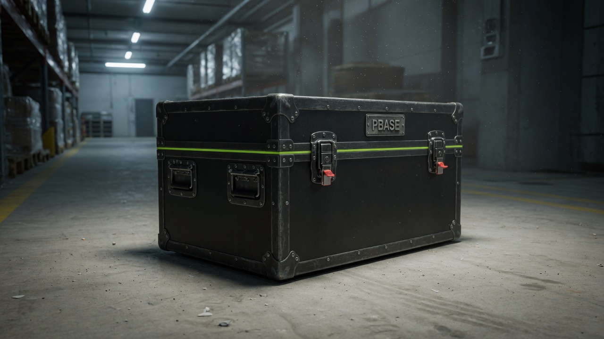

# Portabase

**Your Supabase Escape.** An Apache-2.0 engine that captures a Supabase project — database, Auth, **Storage object bytes**, and Edge Functions — seals it, and stores the capsule in **your** vault.

If the dashboard is banned, official backups are still behind that door. A capsule is already in another building.

[Website](https://portabase.dev) · [What a capsule is](https://portabase.dev/#capsule) · [Security](https://portabase.dev/security) · [Open core](docs/OPEN_CORE.md)

[](LICENSE)
[](https://github.com/data-automation-ai/portabase.dev/actions/workflows/ci.yml)

<p align="center">
  
</p>

<p align="center"><em>A capsule is not a backup you can only reach if the landlord still lets you in.</em></p>

## Community vs Cloud

| | **Community (this repo)** | **Portabase Cloud** |
| --- | --- | --- |
| Capture, encrypt, verify, restore, replay | Yes — full, no license gate | Same engine |
| Who runs the job | You (laptop, VM, NAS, your cloud) | Managed runners |
| Where the capsule lives | **Your** S3 / Dropbox / disk | **Your** S3 / Dropbox (we do not keep the archive) |
| GUI, SMS, live key feed, billing | No | Yes — [$17 / $27](https://portabase.dev/cloud) |
| If portabase.dev disappears | You still have the engine + your capsule | Convenience is gone; Escape is not |

Cloud is optional. The Escape is this repository.

Not affiliated with Supabase, Inc.

## What is in a capsule

| Layer | Official platform backup | Portabase capsule |
| --- | --- | --- |
| Postgres schema + data | Yes | Yes |
| Auth inventory | Behind the same login | Yes |
| Storage **files** (object bytes) | **No** — metadata only | **Yes** |
| Edge Function source | **No** | **Yes** |
| Usable if you cannot log in | **No** | **Yes** — restore into a **new** project |

Each run writes a **manifest** (inventory, fingerprints, COMPLETE / PARTIAL / FAILED). Proof is `replay` into a blank project, not a green upload.

## Quick start

**Need:** Node 20+, `pg_dump` / `psql` on `PATH`, and a Supabase project you are allowed to read.

```bash
git clone https://github.com/data-automation-ai/portabase.dev.git
cd portabase.dev
npm install

# Configure (writes portabase.config.json — do not commit secrets)
npm run portabase -- init

# Check tools and config
npm run portabase -- doctor

# Full capture → encrypted capsule in your destination
npm run portabase -- backup

# Offline integrity (no target project)
npm run portabase -- simulate --capsule ./portabase-capsules/<id>

# Plan a restore (optionally shrink it to fit a cheap test project)
npm run portabase -- restore-plan --capsule ./portabase-capsules/<id>

# Restore / prove into a NEW blank project only
npm run portabase -- replay --capsule ./portabase-capsules/<id> --confirm-target <NEW_REF>
```

Set `PORTABASE_ENCRYPTION_PASSPHRASE` (≥16 characters) and the usual `SUPABASE_*` / target `PORTABASE_TARGET_*` variables in a **gitignored** env file. Never commit keys.

Limited demo (deliberately not a real Escape):

```bash
npm run portabase -- backup --trial
```

Size-bounded path proof (full DB / Auth / Functions, first object per bucket):

```bash
npm run portabase -- backup --storage-first-per-bucket
```

Operator runbook: [docs/ESSENTIALS_RUNBOOK.md](docs/ESSENTIALS_RUNBOOK.md) · Replay: [docs/REPLAY.md](docs/REPLAY.md)

## Crypto

Open source, no closed encryptor: [`utility/capsule-crypto.mjs`](utility/capsule-crypto.mjs) — scrypt → AES-256-GCM. [docs/KEY-PROTECTION.md](docs/KEY-PROTECTION.md)

Standalone: keys never leave your runner. Cloud (optional) may hold a **source** credential for unattended jobs — least privilege, logged, SMS on access, reply `REVOKE KEY` to delete it. Capsule passphrase and capsule bytes stay yours. Details: [docs/SECURITY-TRUST.md](docs/SECURITY-TRUST.md)

## Development

```bash
npm test
npm run dev      # marketing site + console (Vite)
npm run build
```

## Contributing

See [CONTRIBUTING.md](CONTRIBUTING.md) and the [Code of Conduct](CODE_OF_CONDUCT.md). Bug reports and pull requests are welcome. Security issues: [SECURITY.md](SECURITY.md) — do not file a public issue for an active exploit.

## Docs

Public index: [docs/README.md](docs/README.md)

| For | Start here |
| --- | --- |
| Using the engine | This README · [ESSENTIALS_RUNBOOK.md](docs/ESSENTIALS_RUNBOOK.md) |
| Open core vs paid | [OPEN_CORE.md](docs/OPEN_CORE.md) |
| Trust / keys | [SECURITY-TRUST.md](docs/SECURITY-TRUST.md) |
| Cloud billing | [BILLING.md](docs/BILLING.md) |
| Maintainers / agents | [PROJECT.md](PROJECT.md) · [docs/HANDOFF.md](docs/HANDOFF.md) |

## License

[Apache License 2.0](LICENSE) · Copyright 2026 [DataAutomation.ai, LLC](https://github.com/DataAutomation-ai)
