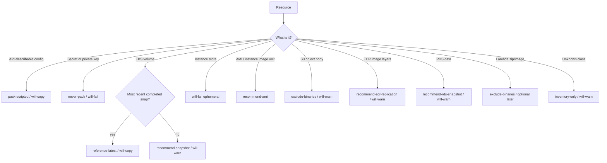

# AWS inventory — resource classes, measurement, binary tree

Companion to [AWS_CAPSULE.md](./AWS_CAPSULE.md). Schema version **`1.0.0`**. Collectors are read-only and boto3-shaped (`utility/aws/interfaces.mjs`).

This document is the catalog `portabase aws inventory` / `portabase aws doctor` / `portabase aws plan` implement against fixtures. Live AWS is **not** enabled. Binaries = **most recent completed backups**; the capsule scripts the runs and never holds the bytes.

---

## 1. Normalized resource

Every inventoried item is flattened to:

| Field | Meaning |
| --- | --- |
| `resourceClass` | CloudFormation-style class (`AWS::EC2::Volume`, …) |
| `id` | Stable identifier (volume id, function name, bucket name) |
| `arn` | When the API provides one |
| `region` | Region or `global` / `null` (IAM, account) |
| `sizeGiB` | GiB (volumes, allocated RDS, object totals, image layers) |
| `encryption` | `{ encrypted, kmsKeyId }` when applicable |
| `dependencies` | Edges (`instance → volume`, `object-body → bucket`) |
| `scriptedPayload` | JSON that **may** enter the capsule |
| `snapshotId` / `recommendedSnapshotId` | Binary **references**, not bytes |

Doctor adds: `severity`, `action`, `coverage`, `restoreBlockers`, `costSignal`, `notCovered`.

---

## 2. Resource classes

### Account + IAM (scripted)

| Class | Measurement | Capsule | Notes |
| --- | --- | --- | --- |
| `AWS::Account` | — | id, aliases, partition | No secrets |
| `AWS::IAM::User` | count | exportable JSON | Access key **IDs** only |
| `AWS::IAM::Role` | count | trust policy + attached ARNs | |
| `AWS::IAM::Policy` | count | customer-managed documents | AWS managed referenced by ARN |
| `AWS::IAM::InstanceProfile` | count | role attachments | |

**Never:** `SecretAccessKey`, password hashes, `CreateAccessKey`.

### Networking (scripted)

VPCs, subnets, route tables, security groups, NACLs, internet / NAT gateways, VPC endpoints. Measured as counts + CIDRs. No binaries.

### EC2

| Class | Size | Scripted | Binary path |
| --- | --- | --- | --- |
| `AWS::EC2::Instance` | — | type, tags, subnet, SGs, **volume IDs**, key name | Disk via attached volumes |
| `AWS::EC2::Volume` | GiB | type, AZ, IOPS, encryption, attachments | **Reference most recent completed snapshot**; `CreateSnapshot` only if none exists |
| `AWS::EC2::Snapshot` | GiB | id, volume map, encryption, region | Most recent per volume; older ignored |
| `AWS::EC2::Image` | GiB (if known) | id, name, snapshot ids | **Most recent** available private EBS AMI per critical series |
| `AWS::EC2::InstanceStoreVolume` | GiB | instance id | **`will-fail`** — cannot snapshot |
| `AWS::EC2::LaunchTemplate` | — | data | |
| `AWS::EC2::KeyPair` | — | **name** only | Private key = never |
| `AWS::AutoScaling::AutoScalingGroup` | desired/min/max | group + template ref | |

### RDS / Aurora

| Class | Size | Scripted | Binary path |
| --- | --- | --- | --- |
| `AWS::RDS::DBInstance` / `DBCluster` | **allocated GiB** | identifier, engine, version, param/option groups, encryption | Recommend **RDS snapshot**; rows **not** pulled in this version |
| Parameter / option groups | — | descriptions | |

### Lambda

| Class | Size | Scripted | Binary path |
| --- | --- | --- | --- |
| `AWS::Lambda::Function` | — | name, runtime, handler, memory, timeout, role, SHA, size, **env names** | |
| `AWS::Lambda::DeploymentPackage` | `CodeSize` | SHA | Exclude zip/image by default; optional later |

### S3

| Class | Size | Scripted | Binary path |
| --- | --- | --- | --- |
| `AWS::S3::Bucket` | — | policy, CORS, lifecycle, versioning, encryption | |
| `AWS::S3::ObjectBody` | Σ object bytes | key inventory + counts | **`exclude-binaries`** |

`list_objects_v2` is metadata (keys, sizes, etags). `get_object` is a forbidden collector method.

### Compute orchestration + traffic

ELB/ALB/NLB, ECS clusters/services/task defs, EKS clusters/nodegroups: descriptions only. Task image *bytes* follow the ECR rule.

### Ops configs (scripted)

CloudWatch alarms, EventBridge rules + target ARNs, SQS attributes, SNS topic attributes.

### Secrets surfaces

| Class | Capsule |
| --- | --- |
| `AWS::SecretsManager::Secret` | Name + ARN |
| `AWS::SecretsManager::SecretValue` | **Never** — `will-fail` if present |
| `AWS::SSM::Parameter` | Name + type |
| `AWS::SSM::SecureStringValue` | **Never** — `will-fail` if present |

### DNS, IaC, images

| Class | Capsule | Binary path |
| --- | --- | --- |
| `AWS::Route53::HostedZone` | records; TXT RDATA redacted when secret-shaped | |
| `AWS::CloudFormation::Stack` | template body if present; NoEcho omitted; CDK metadata | |
| `AWS::ECR::Repository` | name + encryption | |
| `AWS::ECR::Image` | digest, tags, size | Replication or skopeo — not `.pbase` |

---

## 3. Binary decision tree

Implementation: [`utility/aws/binary-decision.mjs`](../utility/aws/binary-decision.mjs) (`decideBinaryPath` + `applySizePolicy`).

Size overlay (after the class tree):

| Measured | Finding |
| --- | --- |
| Scripted JSON ≤ 16 MiB | keep will-copy |
| Scripted JSON 16–100 MiB | will-warn (`scripted-payload-large`) |
| Scripted JSON > 100 MiB | will-fail (`scripted-payload-too-large`) |
| EBS Size missing | will-fail (`unmeasured-volume`) |
| `dumpBytes: true` | will-fail (`binary-dump-refused`) — this format never dumps disk into `.pbase` |

**EC2 volume → most recent completed snapshot** is the required default. Prefer an existing latest snap over `CreateSnapshot`. Raw disk dump into the capsule is not a V2 path. Pinned older snaps require loud `ForceOverride`. Tag filter `PortabaseBackup=true` where applicable.

Implementation: [`utility/aws/latest-backup.mjs`](../utility/aws/latest-backup.mjs) (JS port of the PowerShell law; no AWS mutate).

---

## 4. Doctor findings

| Severity | Meaning |
| --- | --- |
| `will-copy` | Scripted JSON will be packed, **or** a binary **reference** (most recent completed snapshot / AMI id) will be recorded |
| `will-warn` | Config is known but binaries are excluded, snapshot is only recommended, or coverage is incomplete |
| `will-fail` | Restore blocker or forbidden secret: instance store, packed credentials, missing required identity |

Exit code: `2` if any `will-fail`, else `0`. Warnings do not fail the process — they are supposed to be loud.

Every report includes:

- Per-resource size, region, encryption, dependency edges
- Estimated **scripted config bytes** vs **binary footprint GiB**
- Cost **signals** (not quotes) from [`utility/aws/cost-signals.mjs`](../utility/aws/cost-signals.mjs)
- Labels: `NOT PROVEN`, `MATCH is false`, `NOT IN CAPSULE — binary excluded by default`

---

## 5. Cost signals

Published-style **us-east-1** rates as of 2026-09, used only to size the conversation:

| Signal key | Rate / GiB-month |
| --- | --- |
| EBS snapshot storage | $0.05 |
| S3 Standard | $0.023 |
| RDS backup | $0.095 |
| ECR storage | $0.10 |

Disclaimer on every signal: *not a quote, not a bill, not reserved-instance math.* Doctor must not say “this will cost $X.”

---

## 6. Collector contracts (boto3-shaped, read-only)

Method names match boto3 so a later Python or AWS SDK v3 wrapper can implement the same surface.

| Service | Allowed examples | Forbidden examples |
| --- | --- | --- |
| `sts` | `get_caller_identity` | — |
| `iam` | `list_users`, `list_roles`, `list_access_keys` | `create_access_key` |
| `ec2` | `describe_instances`, `describe_volumes`, `describe_snapshots` | `create_snapshot`, `create_image`, `run_instances` |
| `rds` | `describe_db_instances`, `describe_db_snapshots` | `create_db_snapshot` |
| `s3` | `list_buckets`, `get_bucket_*`, `list_objects_v2` | `get_object`, `put_object` |
| `lambda` | `list_functions`, `get_function_configuration` | |
| `secretsmanager` | `list_secrets` | `get_secret_value` |
| `ssm` | `describe_parameters` | `get_parameter` |
| `ecr` | `describe_images` | `put_image`, `replicate_repository` |
| `cloudformation` | `get_template`, `describe_stacks` | `create_stack` |

`createLiveClient()` throws. `createFixtureClient(fixture)` implements reads from JSON and mutating methods as refusal stubs.

---

## 7. Fixture testing

Canonical fixture: [`utility/aws/fixtures/sample-account.json`](../utility/aws/fixtures/sample-account.json).

It includes an encrypted volume without a snapshot (warn + recommend CreateSnapshot), volumes with older/newer/pending snaps (most-recent wins), a tagged `PortabaseBackup=true` snap (tag filter where applicable), a pinned older snap (refused), critical AMI series (latest available only), S3 nightly dumps (most recent per series), instance store (fail), S3 bodies (exclude), ECR image (replication), RDS without snapshot (warn), and IAM without secrets — so schema + decision + doctor + plan tests stay offline.

Also covers DynamoDB table metadata, KMS key **ids/aliases**, CloudFront distributions, Cognito user-pool **ids**, Elastic IPs, NACLs, and route tables. Row data, key material, and object bodies stay out.

Do not point this CLI at account `899867382621` (or any live account) from this scaffold.
